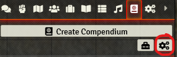
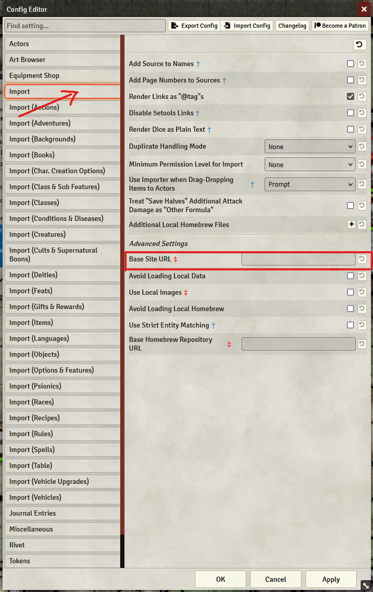

# Set up Plutonium to use a mirror for future imports (Official Mirror)

This is the easiest thing to do to fix future imports, bar [using the extension to fix everything](easiest-way.md).

## Open the  plutonium configuration

Click here:

## Change the base URL

In the window that opens, change the `Base Site URL` field to `https://5etools-mirror-1.github.io/` **WITH THE TRAILING SLASH** . Then reload your game for the change to take effect.

