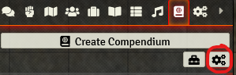

# Migrate to using local images in plutonium (FoundryVTT)

All credits to Lyra214#6717 on the 5et discord for this guide, original comment [here](https://discord.com/channels/363680385336606740/844689468681486407/883399974438707210).

## Why?

By default, the plutonium importer points to the images on the 5eT website, as to not burden your installation with gigabytes of pictures.

But with 5e tools broken, you now have broken images everywhere in your scenes. Not fancy, and bothersome.

Using local images is less easy than setting up the mirrors. It also takes a significant amount of space on your drive. Be certain it's what you want to do.

## I. Cover your ass

**BACK UP YOUR WORLD**. This is really easy to do. You should do it before messing with your data. Always.

There are plenty of ways to do this. Your world data are located in `${Foundry root folder}\Data\worlds\your-world`.

Copy the `your-world` folder in a safe place or make an archive of it (i.e. right-click > 7z > compress, if 7zip is installed).

## II. Get the assets

Download the images [here](https://mega.nz/file/eWQm2LTD#ibOwrcY0DjvgGkEKkKvvZiCuRLmuFQph1TCw233RcmY). This is a BIG download (~3.6Gb).

## III. Install the assets

The images need to go into your plutonium module folder. But there is a caveat: module updates typically wipe the whole folder.
For this reason, we will be using symbolic links to store the image elsewhere and not have to do everything all over again when the next update rolls in.

Once you have the zipfile, unzip it into a folder of your choice. My pick is `C:\User\maravedis\Documents\5eImages`. Your folder structure should look something like this:
```powershell
C:\User\maravedis\Documents\5eImages\tmp\5et\img\...
```

NOTE: `maravedis` in all those example refers to myself as an user. You should obviously replace it by your usename on your machine if you want to mimic the paths I'm using.

We are now going to create a symbolic link between the asset folder and the plutonium module folder. This symbolic link will need to be renewed everytime Plutonium is updated – a small price to pay for salvation. To do so, open a command prompt by pressing the Windows key, typing cmd and pressing enter. You are going to need two paths:

1. the path of our plutonium module folder, to which we're going to add `\img\`, so in this case `YOUR_FOUNDRY_DATA_FOLDER\Data\modules\plutonium\img`
2. the path pointing towards our extracted img folder, in this case `C:\Users\maravedis\Documents\5eImages\tmp\5et\img\`

Enter the following into the command prompt, **making sure to change the paths to suit your installation path**:
```powershell
mklink /D YOUR_FOUNDRY_DATA_FOLDER\Data\modules\plutonium\img C:\Users\maravedis\Documents\5eImages\tmp\5et\img\
```

Now, even if you update plutonium, all you have to do is re-create the symbolic link in the module folder.

## IV. Configure Plutonium

You need to configure plutonium to use local images. Go to plutonium settings, `import` tab, and tick the `Use Local Images`.




Save and refresh your page.

## V. Fix the images of already present tokens

Surged20 did an excellent tool to update your tokens / actors image that you can find [here](https://github.com/surged20/foundryvtt-update-image-macro).

Just follow the instructions :).


