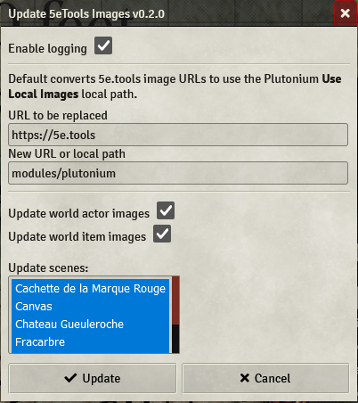
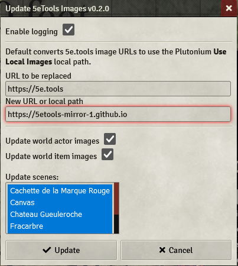
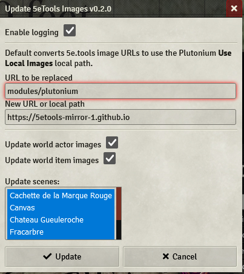

# Use the mirror sites for images

One easy way to correct the images ([but not as easy as the extension, have you checked it out?](easiest-way.md)) to your game is to update all your tokens / actors / items for them to point toward the mirror site.

At the time of writing this, the official temporary mirror is https://5etools-mirror-1.github.io .

## What we're going to do

If you left-click on a faulty token in your game, then gear > image, you can see that the `Token Image Path` looks something like `https://5e.tools/img/MM/Goblin.png`.

That's the culprit right there. `5e.tools` being not available right now makes this URL wrong. You can find this type of URLs on every imported actors and items, as well as the token representing them.

To fix it, we need to change the url from `https://5e.tools/img/MM/Goblin.png` to `https://5etools-mirror-1.github.io/img/MM/Goblin.png`. You _can_ do this by hand. But by the third actors, you'll be tired of it.

## Enter the Macro

surged20 wrote an [awesome tool](https://github.com/surged20/foundryvtt-update-image-macro) for changing the image path of every actor, every item and every token in every scene.

By default, this macro is used to point toward a local installation of the images, but we can really easily use it to make every path point to the mirror.

### I. Cover your ass

**BACK UP YOUR WORLD**. This is really easy to do. You should do it before fiddling with things. Always. Here is an example on how to do it with `tar` on linux.  :
```bash
$ cd $FOUNDRY_DATA_FOLDER/Data/worlds
$ tar -cf your-world.tar your-world
```
and just like that you have a tar archive of your world that you can reopen with `tar -xf your-world.tar`.

On windows with 7zip, you can right-click the world and simply click "Compress".
### II. Install

Follow the install guide that Surge wrote in his README in the macro link above. Be careful to not click the `Update` button yet if you run the macro. That wouldn't fix anything and complicate your life tremendously (if you did, refer to the [Troubleshooting](#troubleshooting) section below).

### III. Run the macro

Running the macro, you should see a window pop up, looking like this:

.

As you can see, the `New URL or local path` field doesn't look like what we want, which is the mirror. So type in this field: `https://5etools-mirror-1.github.io` , no trailing slash. Should look something like this:

.

You can now click update, and the macro will update all your scenes and fix everything!

If you haven't [set up plutonium to use the mirror for imports](), then new imports will have broken images. Refer to the linked guide.

## Troubleshooting

### I was too fast, didn't read, and clicked the 'Update' button before making the change.

I TOLD YOU NOT TO DO THAT. Also, the fix is pretty easy. If you open again a faulty token, you will see that the image path now looks something like :
```
modules/plutonium/img/MM/Goblin.png
```
The fix is simple and uses the macro once more, this time to change this `modules/plutonium` to the mirror. Set up the macro like this and run it:

.
